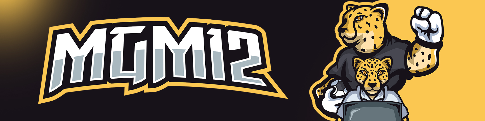

# Website of MGM12

[](https://ui.nuxt.com/pro)



## Setup

Make sure to install the dependencies:

```bash
# pnpm
pnpm install
```

## Development Server

Start the development server on `http://localhost:3000`:

```bash
# pnpm
pnpm run dev
```

## Production

Build the application for production:

```bash
# pnpm
pnpm run build
```

Locally preview production build:

```bash
# pnpm
pnpm run preview
```

Check out the [deployment documentation](https://nuxt.com/docs/getting-started/deployment) for more information.
